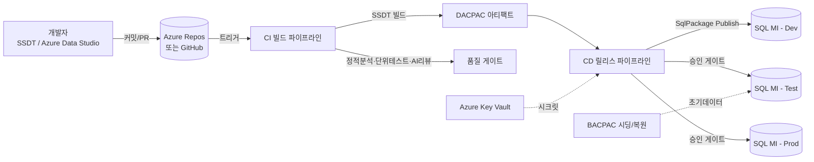
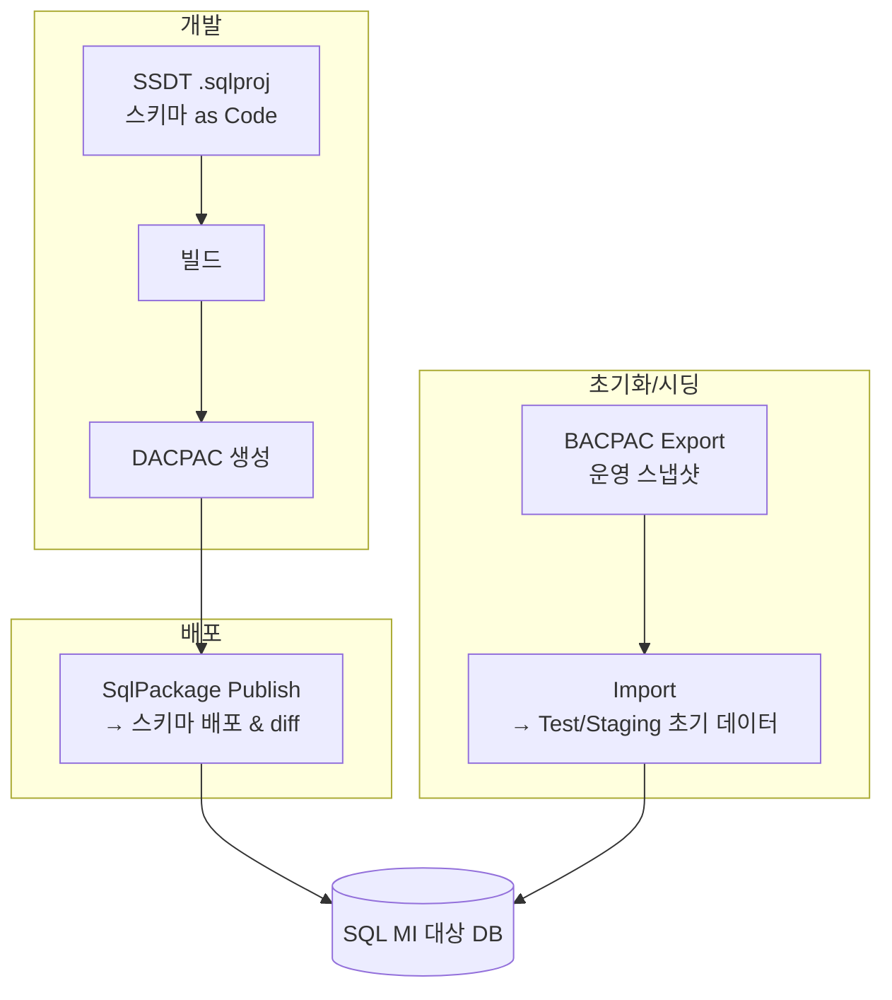
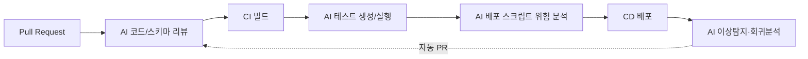

# Azure SQL Managed Instance 데이터베이스 CI/CD 자동화 프로젝트 계획 초안

> Azure DevOps를 활용하여 Azure SQL Managed Instance(SQL MI)의 데이터베이스 소스(스키마 · 메타데이터)를
> 자동으로 배포하고 버전을 관리하는 프로젝트의 기획 · 설계 초안입니다.

실행 가능한 구현 skeleton과 설정 절차는 다음 문서를 참조하십시오.

- [개발 환경 구성 및 테스트](환경-구성-및-테스트.md)
- [Azure DevOps 설정](Azure-DevOps-설정.md)

---

## 1. 프로젝트 개요

### 1.1 배경 및 목적
많은 조직이 애플리케이션 코드는 Git과 CI/CD로 체계적으로 관리하지만, **데이터베이스는 여전히 수작업 스크립트로 배포**하는 경우가 많습니다. 이는 다음과 같은 문제를 낳습니다.

- 환경별 스키마 불일치(“내 환경에서는 됐는데” 문제)
- 변경 이력 추적 불가 → 감사(Audit) · 롤백 어려움
- 배포 실수로 인한 장애 및 데이터 손실 위험
- 릴리스 속도 저하 및 DBA 병목

본 프로젝트의 목적은 **데이터베이스를 코드처럼(Database as Code)** 관리하여, 애플리케이션과 동일한 수준의 자동화 · 버전 관리 · 품질 게이트를 SQL MI에 적용하는 것입니다.

### 1.2 목표 (Goals)
1. 데이터베이스 스키마/메타데이터를 **Git 소스 컨트롤**로 버전 관리
2. **Azure DevOps Pipelines**로 빌드(CI) · 배포(CD) 전 과정 자동화
3. **SSDT(DACPAC)** 기반 상태(State) 배포 + **BACPAC** 기반 데이터 이동/시딩 병행
4. **다중 환경(Dev → Test → Staging → Prod)** 승인 게이트 기반 승격(Promotion)
5. **AI를 활용**하여 리뷰 · 테스트 · 배포 안정성 고도화

### 1.3 범위 (Scope)
| 포함 | 제외(초기 단계) |
|------|----------------|
| 테이블, 뷰, 저장 프로시저, 함수, 인덱스, 제약조건 등 스키마 | 대용량 운영 데이터의 상시 동기화 |
| 참조(reference/lookup) 데이터, 정적 데이터 | 애플리케이션 코드 배포 |
| 배포 파이프라인, 승인 게이트, 롤백 전략 | 크로스 DB엔진(Oracle/PostgreSQL 등) 이관 |

---

## 2. 아키텍처 설계

### 2.1 전체 흐름도



### 2.2 핵심 구성요소
- **소스 컨트롤**: Azure Repos(Git) 또는 GitHub — `.sqlproj` 데이터베이스 프로젝트 저장
- **빌드 에이전트**: Microsoft-hosted `ubuntu-latest`; SQL MI 배포는 VNet에 연결된 private agent
- **아티팩트**: Azure Pipeline Artifact로 게시하는 `DACPAC`(스키마 상태), 필요 시 `BACPAC`(스키마+데이터)
- **배포 도구**: SDK-style SQL project를 `dotnet build`로 빌드하고 고정 버전 `SqlPackage` CLI로 배포
- **인증**: Azure Resource Manager 서비스 연결의 Workload Identity Federation + Microsoft Entra access token
- **네트워크**: SQL MI는 VNet 내부에 위치 → self-hosted 에이전트 또는 프라이빗 연결 고려

---

## 3. 요구사항 1 — Azure DevOps를 통한 데이터베이스 소스 자동화 구현

### 3.1 State-based vs Migration-based 배포 방식
데이터베이스 자동화 전략은 크게 두 가지로 나뉩니다. 본 프로젝트는 **SSDT를 사용하므로 State-based가 기본**이며, 데이터 이관이 필요한 경우에만 Migration/BACPAC을 보완적으로 사용합니다.

| 구분 | State-based (상태 기반) | Migration-based (마이그레이션 기반) |
|------|------------------------|-------------------------------------|
| 개념 | "최종 상태"를 정의하면 도구가 차이(diff)를 계산해 배포 | 순서가 있는 변경 스크립트를 차례로 적용 |
| 대표 도구 | **SSDT/DACPAC**, Redgate SQL Source Control | **Flyway, Liquibase, DbUp**, EF Migrations |
| 장점 | 형상 관리 쉬움, 드리프트 감지, 리뷰 용이 | 데이터 마이그레이션·복잡한 변경에 강함, 롤백 스크립트 명시 |
| 단점 | 복잡한 데이터 변형/순서 제어 어려움 | 상태 파악·드리프트 감지 어려움 |

### 3.2 Azure DevOps CI/CD 파이프라인 예시 (YAML)

**CI(빌드): SDK-style SQL project → DACPAC Pipeline Artifact**

```yaml
trigger:
  branches: { include: [ main ] }
  paths:
    include:
      - database/**
      - eng/**
      - tests/**

stages:
  - stage: Build
    jobs:
      - job: BuildDacpac
        pool:
          vmImage: ubuntu-latest
        steps:
          - checkout: self
            fetchDepth: 0

          - task: UseDotNet@2
            inputs:
              packageType: sdk
              version: 10.x

          - pwsh: ./eng/Build.ps1 -DacVersion "1.0.$(Build.BuildId).0"
            displayName: Build SDK-style SQL project

          - pwsh: ./eng/Test-SqlPolicy.ps1
            displayName: Run deterministic SQL policy

          - publish: artifacts/dacpac
            artifact: database
            displayName: Publish immutable DACPAC
```

**CD(배포): 동일 DACPAC → SQL MI(WIF 및 Entra token 인증)**

```yaml
- deployment: DeployDacpac
  environment: sqlmi-test   # Approvals and checks는 Environment에서 관리
  pool:
    name: sqlmi-private-agents
  strategy:
    runOnce:
      deploy:
        steps:
          - download: current
            artifact: database

          - task: UseDotNet@2
            inputs:
              packageType: sdk
              version: 10.x

          - pwsh: |
              $toolPath = Join-Path "$(Agent.TempDirectory)" "sqlpackage"
              dotnet tool install `
                --tool-path $toolPath `
                Microsoft.SqlPackage `
                --version "170.4.83" `
                --allow-roll-forward
            displayName: Install pinned SqlPackage

          - task: AzureCLI@2
            displayName: Publish DACPAC with Microsoft Entra token
            inputs:
              azureSubscription: sc-sqlmi-wif
              scriptType: pscore
              scriptLocation: inlineScript
              inlineScript: |
                $token = (az account get-access-token `
                  --resource "https://database.windows.net/" `
                  --query accessToken `
                  --output tsv).Trim()
                $sqlPackage = Join-Path "$(Agent.TempDirectory)" "sqlpackage/sqlpackage"
                if ($IsWindows) {
                  $sqlPackage += ".exe"
                }
                $connection = "Server=tcp:$(sqlServer),$(sqlPort);Initial Catalog=$(databaseName);Encrypt=True;TrustServerCertificate=False;"

                & $sqlPackage `
                  /Action:Publish `
                  "/SourceFile:$(Pipeline.Workspace)/database/App.Database.dacpac" `
                  "/TargetConnectionString:$connection" `
                  "/AccessToken:$token" `
                  "/Profile:pipelines/profiles/sqlmi-test.publish.xml" `
                  "/p:CommandTimeout=$(sqlCommandTimeout)"
```

실제 파이프라인은 `pipelines/templates/deploy-stage.yml`에서 배포 전에 `Script`와
`DeployReport`를 생성하며 `deploy.sql`은 결정론적 위험 DDL 게이트를 통과해야 합니다.
승인 이후 대상 데이터베이스의 현재 보고서를 같은 profile로 다시 비교한 뒤 동일한
DACPAC을 게시합니다.

### 3.3 핵심 자동화 모범 사례
- **Build once, deploy many**: DACPAC을 한 번만 빌드해 Dev/Test/Prod에 동일 아티팩트 승격
- **배포 전 스크립트 검토**: `SqlPackage /Action:Script`로 변경 예정 SQL을 생성해 DBA가 사전 리뷰
- **데이터 손실 방지 가드**: `BlockOnPossibleDataLoss=true`
- **인증·시크릿 관리**: Workload Identity Federation과 Entra token을 우선 사용하고, SQL 인증이 불가피한 경우에만 Key Vault 사용
- **환경별 승인 게이트**: Azure DevOps *Environments*에 프로덕션 승인자 지정
- **네트워크**: 같은 VNet은 VNet-local endpoint, 다른 VNet은 private endpoint/peering/VPN을 통해 self-hosted agent 연결

### 3.4 자동화를 구현하는 다른 서비스/도구 소개
Azure DevOps + SSDT 외에도 데이터베이스 배포 자동화를 지원하는 대표 도구들입니다. 조직의 상황에 따라 병행/대체를 검토할 수 있습니다.

| 도구 | 방식 | 특징 | 적합한 경우 |
|------|------|------|-------------|
| **Redgate (SQL Change Automation / Flyway Enterprise)** | State + Migration | 감사·거버넌스·드리프트 감지 강력, 규제 산업에 강점 | 엔터프라이즈, 컴플라이언스 중요 |
| **Flyway** | Migration | "설정보다 관례", 50+ DB 지원, CLI/Docker 친화 | 단순·순차 마이그레이션, 멀티 DB |
| **Liquibase** | Migration | XML/YAML/JSON/SQL 체인지로그, 강력한 롤백, DB 비종속 | 크로스 벤더, 롤백 중시 |
| **DbUp** | Migration | 경량 .NET(C#) 라이브러리, 앱 배포에 내장 | 클라우드 네이티브·마이크로서비스 |
| **EF Core Migrations** | Migration | 코드 퍼스트, .NET ORM 통합 | .NET 애플리케이션 중심 |
| **GitHub Actions** | CI/CD 오케스트레이션 | Azure DevOps 대안, `sql-action` 등 | GitHub 중심 워크플로 |
| **Azure SQL Database Projects (신형 SDK-style)** | State | VS/VS Code/CLI(DacFx) 크로스플랫폼 빌드 | 크로스플랫폼·CLI 빌드 필요 |

> **CI/CD 오케스트레이터 대안**: Azure DevOps Pipelines ↔ **GitHub Actions**, Jenkins, GitLab CI 등으로 대체 가능하며, 배포 도구(SSDT/Flyway 등)는 오케스트레이터와 독립적으로 조합할 수 있습니다.

---

## 4. 요구사항 2 — Azure SQL SSDT와 BACPAC 활용

### 4.1 SSDT / DACPAC / BACPAC 개념 정리
| 항목 | 내용 | 포함 요소 | 주요 용도 |
|------|------|-----------|-----------|
| **SSDT** | SQL Server Data Tools. Visual Studio 기반 DB 개발 도구 | `.sqlproj` 프로젝트 | 스키마 형상관리·빌드 |
| **DACPAC** | Data-tier Application Package | **스키마만** (데이터 없음) | 상태 기반 배포, diff 배포 |
| **BACPAC** | Backup Package | **스키마 + 데이터** | 마이그레이션, 백업/복원, 환경 시딩 |

### 4.2 본 프로젝트에서의 조합 전략


- **DACPAC(SSDT)**: 매 릴리스마다 스키마 변경을 안전하게 diff 배포 (핵심 파이프라인)
- **BACPAC**: 신규 테스트 환경 구성, 운영 유사 데이터로 시딩, 재해복구/온보딩 시 사용 (보조)
- **주의**: BACPAC은 트랜잭션 일관성을 보장하지 않으므로(온라인 export 시), 운영에서는 정지 시점 스냅샷/복사본에서 export 권장

### 4.3 SQL MI 특화 고려사항
- SQL MI는 **인스턴스 수준 기능**(SQL Agent Job, 크로스 DB 쿼리, CLR 등) 지원 → SSDT 프로젝트에 인스턴스 오브젝트 포함 여부 결정
- SQL MI는 기본적으로 **VNet 프라이빗** → 파이프라인 에이전트의 네트워크 접근 설계 필수
- BACPAC의 대용량 export/import 시 **Azure Blob Storage** 경유 권장

### 4.4 실제 기업 활용 사례
- **패턴의 보편성**: SSDT(.sqlproj) → Git → Azure DevOps 빌드로 DACPAC 생성 → 다중 환경 승격 → 운영 승인 게이트 구조는 금융·제조·SaaS 등 다수 엔터프라이즈에서 표준적으로 채택하는 방식입니다. Microsoft Learn과 다수 기업 기술 블로그(예: MSSQLTips, C# Corner, STL Digital 등)에 동일한 아키텍처가 반복적으로 소개됩니다.
- **오픈소스 참고 사례**: 실제 동작하는 Azure SQL CI/CD 파이프라인 예제와 YAML 샘플이 공개되어 있어 참고 구현으로 활용 가능
  - `github.com/thomasbeo/Azure-SQL-CICD-Pipeline`
- **BACPAC 활용 사례**: 신규 고객 환경 온보딩, 재해복구 리허설, 운영 유사 데이터로 QA 환경을 빠르게 클론하는 용도로 다수 조직이 사용

> ⚠️ *구체적 기업명 사례는 공개 레퍼런스에 따라 달라질 수 있으므로, 최종 문서화 시 고객사에 제출하기 전 각 출처의 최신 사례를 재확인하는 것을 권장합니다.*

**참고 출처**
- Microsoft Learn — [Deploy to Azure SQL Database (Azure Pipelines)](https://learn.microsoft.com/en-us/azure/devops/pipelines/targets/azure-sqldb)
- Microsoft Learn — [SQL Projects Automation](https://learn.microsoft.com/en-us/sql/tools/sql-database-projects/sql-projects-automation)
- MSSQLTips — [Azure DevOps and CI/CD for Azure SQL Database](https://www.mssqltips.com/sqlservertip/6557/)

---

## 5. 요구사항 3 — AI를 활용한 CI/CD 파이프라인 고도화

AI(특히 GitHub Copilot 및 LLM)는 2024~2025년을 기점으로 **파이프라인 내부의 자율 에이전트(Agentic Workflow)**로 진화했습니다. 단순 코드 제안을 넘어, PR/이슈/스케줄을 트리거로 코드·테스트·마이그레이션을 생성·검토·수정합니다.

### 5.1 적용 지점 (파이프라인 단계별)


| 단계 | AI 활용 | 기대 효과 |
|------|---------|-----------|
| **PR 리뷰** | 스키마 변경 위험(데이터 손실, 인덱스 누락, 권한, 롤백 전략) 자동 점검 | 조기 결함 발견, DBA 부담 완화 |
| **테스트 생성** | tSQLt 단위/통합 테스트 자동 생성(Copilot) | 테스트 백로그 감소 |
| **배포 스크립트 분석** | `SqlPackage` diff 스크립트를 AI가 검토하여 위험 요약·설명 | 프로덕션 사고 예방 |
| **문서화** | 변경 내역·마이그레이션 문서 자동 생성(Flyway AI 문서화 등) | 감사·인수인계 용이 |
| **자가 치유(Self-healing)** | 실패한 테스트/빌드를 AI가 분석 후 수정 PR 자동 생성 | 파이프라인 복구 시간 단축 |
| **운영 이상탐지** | 배포 후 성능/쿼리 회귀를 AI가 감지·알림 | MTTR 감소 |

### 5.2 구체적 도입 방안
1. **GitHub Copilot 코드 리뷰**: PR에 Copilot 리뷰어를 붙여 SQL 변경의 안티패턴(예: `NOT NULL` 컬럼 추가 시 기본값 누락, 대형 테이블 잠금 유발 DDL) 자동 코멘트
2. **Copilot을 CI에 통합**: GitHub Actions/Azure Pipelines에서 Copilot CLI/에이전트를 호출해 실패 로그 분석 및 수정 제안
3. **AI 기반 테스트 생성**: 저장 프로시저/함수에 대한 tSQLt 테스트를 AI로 초안 생성 후 사람 검수
4. **마이그레이션 안전성 검사**: 배포 diff 스크립트를 LLM에 전달해 "위험/주의/안전" 등급과 근거를 리포트로 출력, 프로덕션 승인 게이트의 참고 자료로 활용
5. **하이브리드 게이트 모델**: 결정론적 검사(린트/테스트)는 기존 CI가, 정성적 검사(설계 결함·위험도)는 AI가 담당하되 **프로덕션 배포는 반드시 사람 승인**으로 게이트

### 5.3 가드레일(중요)
- AI는 **자동화를 대체하지 않고 보강**한다 — 결정론적 검증은 유지
- AI 에이전트는 **샌드박스·제한 권한**에서 실행, 지정 브랜치만 push, 전체 감사 로그 유지
- 프로덕션·위험 DB 변경은 **사람 승인 필수** 게이트 유지
- 프롬프트/컨텍스트에 **민감 데이터·시크릿 미포함**

---

## 6. 단계별 실행 로드맵

| 단계 | 기간(예시) | 산출물 |
|------|-----------|--------|
| **Phase 0 — 준비** | 1~2주 | 리포지토리 구성, SQL MI 접근/네트워크 설계, 서비스 주체·Key Vault 구성 |
| **Phase 1 — 소스화** | 2~3주 | 기존 DB를 SSDT `.sqlproj`로 리버스 엔지니어링, Git 등록, 브랜치 전략 수립 |
| **Phase 2 — CI 구축** | 2주 | 빌드 파이프라인, DACPAC 아티팩트, 정적 분석/단위 테스트 |
| **Phase 3 — CD 구축** | 2~3주 | Dev/Test/Prod 배포, 승인 게이트, 롤백 전략, BACPAC 시딩 |
| **Phase 4 — AI 고도화** | 2~3주 | AI 코드 리뷰, 테스트 생성, 배포 위험 분석 통합 |
| **Phase 5 — 안정화** | 지속 | 모니터링, 드리프트 감지, 문서화, 팀 온보딩 |

---

## 7. 위험 요소 및 대응

| 위험 | 영향 | 대응 |
|------|------|------|
| SQL MI VNet 격리로 에이전트 접근 불가 | 배포 실패 | VNet-local endpoint 또는 private endpoint/peering/VPN 경로의 self-hosted agent |
| 스키마 변경 중 데이터 손실 | 데이터 유실 | `BlockOnPossibleDataLoss=true`, 사전 스크립트 리뷰 |
| 드리프트(수동 변경) | 환경 불일치 | 정기 드리프트 감지, 수동 변경 금지 정책 |
| 시크릿 노출 | 보안 사고 | Key Vault, Managed Identity, 하드코딩 금지 |
| 롤백 어려움(State 방식) | 복구 지연 | 배포 전 백업/스냅샷, 롤백 스크립트 준비 |
| AI 오판 | 잘못된 승인 | 사람 최종 승인 게이트 유지 |

---

## 8. 성공 지표 (KPI)
- 배포 리드타임(커밋→운영 반영) 단축률
- 배포 실패율 / 롤백 빈도 감소
- 환경 간 스키마 드리프트 건수 = 0 지향
- 배포당 수동 개입(수작업 스크립트) 횟수 감소
- AI 리뷰로 사전 차단된 위험 변경 건수

---

## 9. 요약
- **핵심 축**: `SSDT(.sqlproj) → Git → Azure DevOps CI(DACPAC) → 다중 환경 CD → 운영 승인 게이트`
- **SSDT/DACPAC**로 스키마를 상태 기반 배포하고, **BACPAC**으로 데이터 시딩/복원을 보완
- **다른 도구**(Redgate·Flyway·Liquibase·DbUp·GitHub Actions)와 조합/대체 가능
- **AI**로 리뷰·테스트·배포 위험 분석을 자동화하되, **프로덕션은 사람 승인**으로 가드레일 유지

---

### 부록 A — 참고 링크
- Deploy to Azure SQL Database (Azure Pipelines): https://learn.microsoft.com/en-us/azure/devops/pipelines/targets/azure-sqldb
- SQL Projects Automation: https://learn.microsoft.com/en-us/sql/tools/sql-database-projects/sql-projects-automation
- Azure DevOps CI/CD for Azure SQL Database (MSSQLTips): https://www.mssqltips.com/sqlservertip/6557/
- Azure SQL CI/CD Pipeline 예제: https://github.com/thomasbeo/Azure-SQL-CICD-Pipeline
- Flyway / Liquibase / Redgate 공식 사이트
